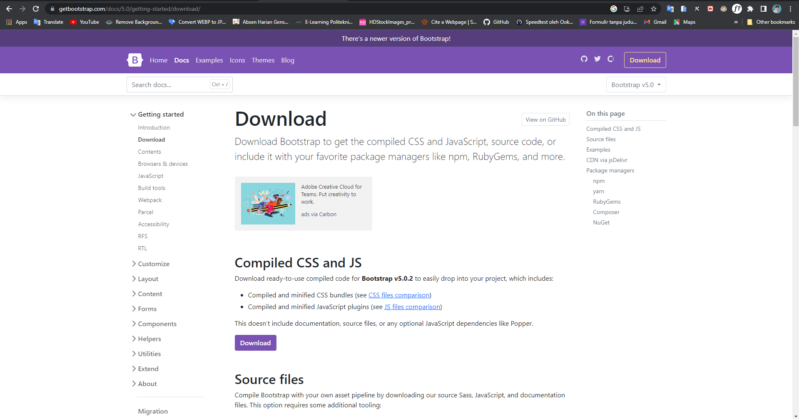
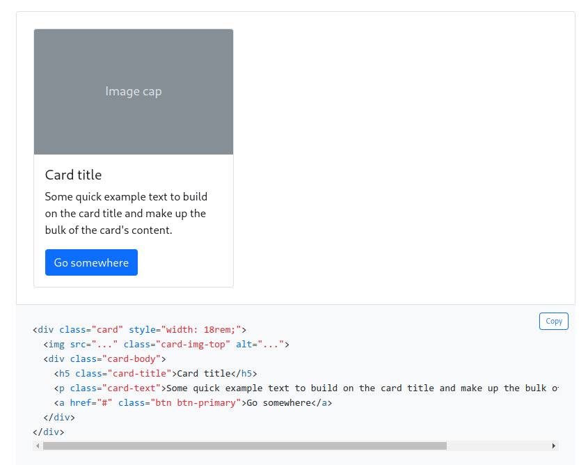
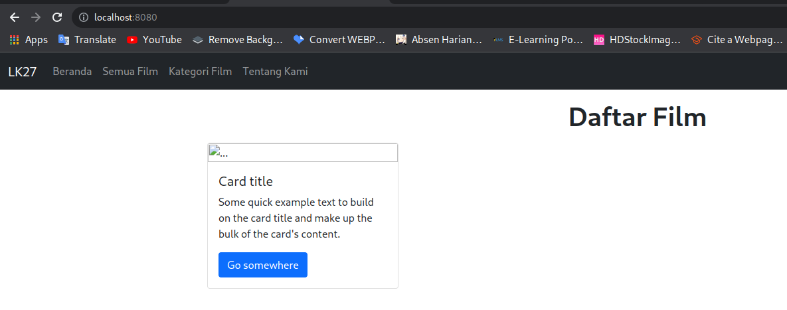
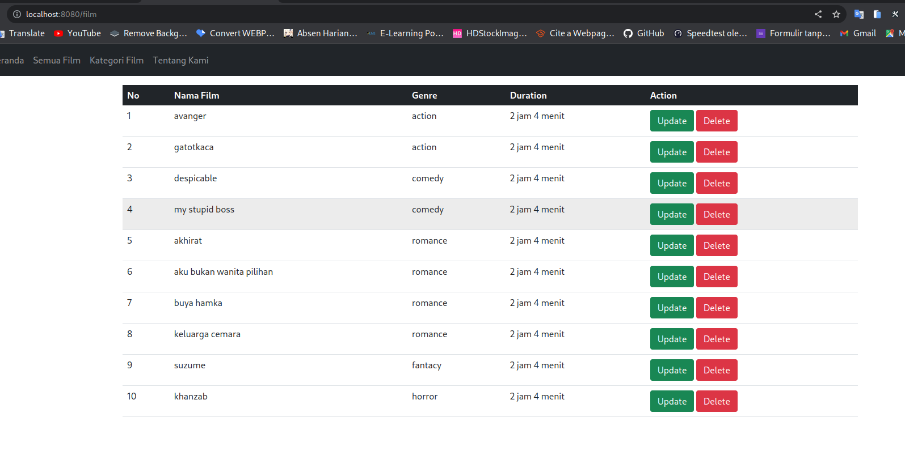
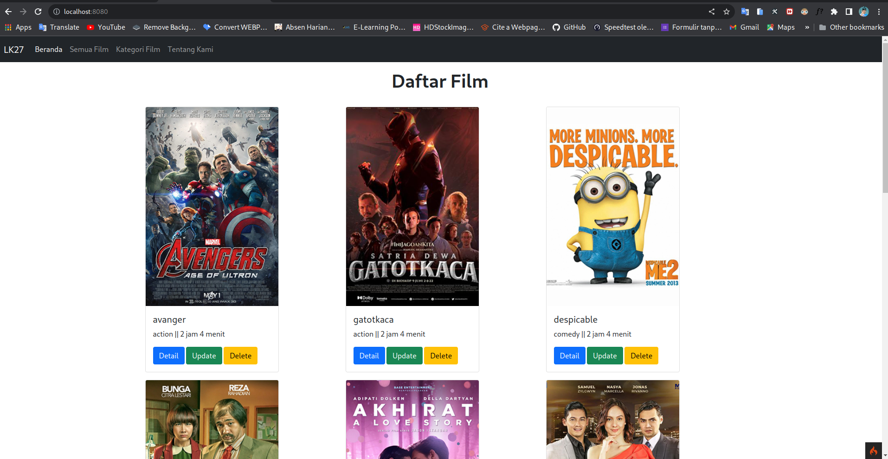

# PHP Framework - Membuat Tampilan Menarik Menggunakan Bootstrap
## A. Tujuan (Capaian Pembelajaran)
Setelah praktikum ini, praktikan diharapkan dapat:  
1.	Mengerti dan mengimplementasikan Bootstrap dalam tampilan web.  
2.	Merancang tampilan web yang responsif menggunakan Bootstrap. 
## B. Peralatan yang digunakan  
1.	Web Editor : Visual Studio Code  
2.	Web Browser : Google Chrome  
3.	OS PC : Arch Linux  
4.	XAMPP : versi 8.2  
5.	CodeIgniter : 4.1.1  
## C. Hasil dan Pembahasan  
1.	Pertama ubah terlebih dahulu default route ubah pada file ``Routes`` di folder ```config```  
  
Setelah kemarin kita sudah membuat table genre dan juga sudah menggantikan colom 
genre pada table film menjadi `id_genre` selanjutnya kita akan melakukan `join` pada 
kedua table tersebut  
2.	Kita buat function `getAllDataJoin` di file model film 
```php
<?php

namespace App\Models;

use CodeIgniter\Model;

class FilmModel extends Model
{
    protected $table = 'film';
    protected $primaryKey = 'id';
    protected $useAutoIncrement = true;
    protected $allowedFields = [];

    public function getAllDataJoin()
    {
        $query = $this->db->table("film")
            ->select("film.*, genre.nama_genre")
            ->join("genre", "genre.id_genre = film.id_genre");

        return $query->get()->getResultArray();
    }

    public function getAllData()
    {
        return $this->findAll();
    }
}

```  
Fungsi `getAllDataJoin()` ini bertugas untuk mengambil semua data dari tabel film dan 
menggabungkannya dengan data dari tabel genre berdasarkan `id_genre`. Jadi, jika kita 
memiliki film dan genre film dalam database kita, fungsi ini akan mengumpulkan 
semua informasi tersebut dan menggabungkannya menjadi satu. Hasilnya, kita akan 
mendapatkan daftar film lengkap dengan genre masing-masing dalam bentuk array.

3.	Setelah itu ubah function method `all` menjadi seperti ini pada file Controller `Film` 
nya menjadi seperti ini
 ```php
<?php

namespace App\Controllers;

use App\Controllers\BaseController;
use App\Models\FilmModel;

class Film extends BaseController
{
    protected $film;

    public function __construct()
    {
        $this->film = new FilmModel();
    }

    public function index()
    {
        $data['dataFilm'] = $this->film->getAllDataJoin();
        return view("film/table", $data);
    }

    public function all()
    {
        $data['data_film'] = $this->film->getAllDataJoin();
        return view("film/index", $data);
    }
}

```  
Method `all()` ini bekerja untuk mengumpulkan semua data film beserta genre masing-masing dari database `(melalui fungsi getAllDataJoin())`, lalu menampilkan data tersebut 
di halaman `film/index`.<br><br>
4.	Setelah melakukan konfigurasi seperti diatas sekarng kita akan menggunakan bootraps 5 untuk mempercantik tampilan dan lebih resposnsive. Pertaman download terlebih dahulu bootsraps 5 nya di  https://getbootstrap.com/docs/5.0/getting-started/download  
  
5.	Setelah di download ektrak file nya kemudian copy folder css dan js ke folder `public->assets`. Setelah itu pada file index yang ada di `views` film kita hubungkan ke file css dari bootraps dan javacript nya   
  
  
  
6.	Setelah itu kita akan membuat `navbar`, kita bias mencarinya di dokumentasi bootsraps 5 dengan cara mengetikan `navbar` kemudian cari navbar sesuai selera, copy code nya kemudian pastekan ke file php `index`  
  
Lalu kita edit sesuai selera, untuk pengeditan kita bias membaca lebih lanjut dokumentasi dari bootrsaps  
berikut adalah source code `index.php`  
```html
<html lang="en">
<head>
  <meta charset="UTF-8">
  <meta http-equiv="X-UA-Compatible" content="IE=edge">
  <meta name="viewport" content="width=device-width, initial-scale=1.0">
  <title>LK27</title>
  <link rel="stylesheet" href="/assets/css/bootstrap.min.css">
</head>
<body>
  <nav class="navbar navbar-expand-lg navbar-dark bg-dark">
    <div class="container-fluid">
      <a class="navbar-brand" href="#">LK27</a>
      <button class="navbar-toggler" type="button" data-bs-toggle="collapse" data-bs-target="#navbarNav"
        aria-controls="navbarNav" aria-expanded="false" aria-label="Toggle navigation">
        <span class="navbar-toggler-icon"></span>
      </button>
      <div class="collapse navbar-collapse" id="navbarNav">
        <ul class="navbar-nav">
          <li class="nav-item">
            <a class="nav-link" aria-current="page" href="/">Beranda</a>
          </li>
          <li class="nav-item">
            <a class="nav-link" href="/film">Semua Film</a>
          </li>
          <li class="nav-item">
            <a class="nav-link" href="#">Kategori Film</a>
          </li>
          <li class="nav-item">
            <a class="nav-link" href="#">Tentang Kami</a>
          </li>
        </ul>
      </div>
    </div>
  </nav>
  <script src="/assets/js/bootstrap.js"></script>
  <script src="/assets/js/bootstrap.min.js"></script>
</body>
</html>
```  
Kemudian akses https://localhost:8080 dan ini hasilnya  
  
7.	Setelah berhasil membuat navbar selanjutnya kita akan menampilkan data film menggunakan style card yang ada di bootraps. Setelah tanda tutup nav ketikan kode html seperti ini  
      
div dengan kelas container yang berfungsi sebagai wadah utama. Di dalam container ini, ada sebuah judul (h1) dengan teks "Daftar Film" yang ditempatkan di tengah (text-center) dan memiliki font weight bold (fw-bold). Judul ini juga memiliki margin atas dan bawah (mt-3 mb-3) untuk memberi jarak dari elemen lain. Selanjutnya, ada div lain dengan kelas row, yang digunakan untuk menampung kolom-kolom dalam layout grid Bootstrap. Di dalam row ini, ada div dengan kelas col-md-4 yang berarti bahwa kolom ini akan mengambil 4 dari 12 kolom tersedia pada layar medium (md) dan lebih besar.  
Selanjutnya copy kode card dari bootraps  
  
Letakan kedalam div col-md-4  
  
Hasil sementaranya akan seperti ini  
  
Terakhir kita tampilkan data dari database ke dalam card  
  
Maka keseluruhan kode seperti ini  
```php
<html lang="en">
<head>
  <meta charset="UTF-8">
  <meta http-equiv="X-UA-Compatible" content="IE=edge">
  <meta name="viewport" content="width=device-width, initial-scale=1.0">
  <title>LK27</title>
  <link rel="stylesheet" href="/assets/css/bootstrap.min.css">
</head>
<body>
  <nav class="navbar navbar-expand-lg navbar-dark bg-dark">
    <div class="container-fluid">
      <a class="navbar-brand" href="#">LK27</a>
      <button class="navbar-toggler" type="button" data-bs-toggle="collapse" data-bs-target="#navbarNav"
        aria-controls="navbarNav" aria-expanded="false" aria-label="Toggle navigation">
        <span class="navbar-toggler-icon"></span>
      </button>
      <div class="collapse navbar-collapse" id="navbarNav">
        <ul class="navbar-nav">
          <li class="nav-item">
            <a class="nav-link" aria-current="page" href="/">Beranda</a>
          </li>
          <li class="nav-item">
            <a class="nav-link" href="/film">Semua Film</a>
          </li>
          <li class="nav-item">
            <a class="nav-link" href="#">Kategori Film</a>
          </li>
          <li class="nav-item">
            <a class="nav-link" href="#">Tentang Kami</a>
          </li>
        </ul>
      </div>
    </div>
  </nav>
  <div class="container">
    <h1 class="text-center fw-bold mt-3 mb-3">Daftar Film</h1>
    <div class="row">
      <?php foreach ($data_film as $row) : ?>
      <div class="col-md-4">
        <div class="card mt-3" style="width: 18rem;">
          " class="card-img-top" alt="...">
          <div class="card-body">
            <h5 class="card-title"><?= $row['nama_film'] ?></h5>
            <p class="card-text"><?= $row['nama_genre'] ?> || <?= $row['duration'] ?></p>
            <a href="#" class="btn btn-primary">Detail</a>
          </div>
        </div>
      </div>
      <?php endforeach; ?>
    </div>
  </div>
  <script src="/assets/js/bootstrap.min.js"></script>
</body>
</html>
```  
Jalanka di web browser https://localhost:8080  
  
Setelah kita membuat tampilan semua film selanjutnya kita menampilkan semua film tadi di halaman baru dalam bentuk table  
Pastikan method index pada file controller film seperti ini  
  
Lalu kita buat file table.php di folder views film kita untuk nama nya bisa bebas  
```php
<html lang="en">
<head>
  <meta charset="UTF-8">
  <meta http-equiv="X-UA-Compatible" content="IE=edge">
  <meta name="viewport" content="width=device-width, initial-scale=1.0">
  <title>LK27</title>
  <link rel="stylesheet" href="/assets/css/bootstrap.min.css">
</head>
<body>
  <nav class="navbar navbar-expand-lg navbar-dark bg-dark">
    <div class="container-fluid">
      <a class="navbar-brand" href="#">LK27</a>
      <button class="navbar-toggler" type="button" data-bs-toggle="collapse" data-bs-target="#navbarNav"
        aria-controls="navbarNav" aria-expanded="false" aria-label="Toggle navigation">
        <span class="navbar-toggler-icon"></span>
      </button>
      <div class="collapse navbar-collapse" id="navbarNav">
        <ul class="navbar-nav">
          <li class="nav-item">
            <a class="nav-link" aria-current="page" href="/">Beranda</a>
          </li>
          <li class="nav-item">
            <a class="nav-link" href="/film">Semua Film</a>
          </li>
          <li class="nav-item">
            <a class="nav-link" href="#">Kategori Film</a>
          </li>
          <li class="nav-item">
            <a class="nav-link" href="#">Tentang Kami</a>
          </li>
        </ul>
      </div>
    </div>
  </nav>
  <div class="container mt-3">
    <div class="row">
      <div class="col-md-13">
        <table class="table table-hover">
          <tr class="table-dark">
            <th>No</th>
            <th>Nama Film</th>
            <th>Genre</th>
            <th>Duration</th>
            <th>Action</th>
          </tr>
          <?php $i = 1; foreach ($dataFilm as $row) : ?>
          <tr>
            <td><?= $i++ ?></td>
            <td><?= $row["nama_film"] ?></td>
            <td><?= $row["nama_genre"] ?></td>
            <td><?= $row["duration"] ?></td>
            <td>
              <a href="" class="btn btn-success">Update</a>
              <a href="" class="btn btn-danger">Delete</a>
            </td>
          </tr>
          <?php endforeach ?>
        </table>
      </div>
    </div>
  </div>
  <script src="/assets/js/bootstrap.min.js"></script>
</body>
</html>
```  
Jalankan http://localhost:8080/film di browser  
  
## C. Tugas  
1. Membuat layouting  
Buat struktur projek view seperti ini  
  
Buat file layout.php  
```php
<html lang="en">
<head>
  <meta charset="UTF-8">
  <meta http-equiv="X-UA-Compatible" content="IE=edge">
  <meta name="viewport" content="width=device-width, initial-scale=1.0">
  <title>LK27</title>
  <link rel="stylesheet" href="/assets/css/bootstrap.min.css">
</head>
<body>
  <nav class="navbar navbar-expand-lg navbar-dark bg-dark">
    <div class="container-fluid">
      <a class="navbar-brand" href="#">LK27</a>
      <button class="navbar-toggler" type="button" data-bs-toggle="collapse" data-bs-target="#navbarNav"
        aria-controls="navbarNav" aria-expanded="false" aria-label="Toggle navigation">
        <span class="navbar-toggler-icon"></span>
      </button>
      <div class="collapse navbar-collapse" id="navbarNav">
        <ul class="navbar-nav">
          <li class="nav-item">
            <a class="nav-link" aria-current="page" href="/">Beranda</a>
          </li>
          <li class="nav-item">
            <a class="nav-link" href="/film">Semua Film</a>
          </li>
          <li class="nav-item">
            <a class="nav-link" href="/genre">Kategori Film</a>
          </li>
          <li class="nav-item">
            <a class="nav-link" href="/aboutMe">Tentang Kami</a>
          </li>
        </ul>
      </div>
    </div>
  </nav>
  <div class="container">
    <div class="container">
      <?= $this->renderSection('content') ?>
    </div>
  </div>
  <script src="/assets/js/bootstrap.min.js"></script>
</body>
</html>
```  
fungsi ``renderSection('content')`` akan merender atau menampilkan bagian 'content' dari halaman web  
Kemudian hapus header dan footer pada file index dan file table yang ada di folder film File ``index.php``  
```php
<?= $this->extend('layout/Layout') ?>
<?= $this->section('content') ?>
<div class="container">
  <h1 class="text-center fw-bold mt-3 mb-3">Daftar Film</h1>
  <div class="row">
    <?php foreach ($data_film as $row) : ?>
    <div class="col-md-4">
      <div class="card mt-3" style="width: 18rem;">
        " class="card-img-top" alt="...">
        <div class="card-body">
          <h5 class="card-title"><?= $row['nama_film']?></h5>
          <p class="card-text"><?= $row['nama_genre']?> || <?= $row['duration']?></p>
          <a href="#" class="btn btn-primary">Detail</a>
        </div>
      </div>
    </div>
    <?php endforeach; ?>
  </div>
</div>
<?= $this->endSection() ?>
```  
buat File table.php  
```php
<?= $this->extend('layout/Layout') ?>
<?= $this->section('content') ?>
<div class="container mt-3">
  <div class="row">
    <div class="col-md-13">
      <table class="table table-hover">
        <tr class="table-dark">
          <th>No</th>
          <th>Nama Film</th>
          <th>Genre</th>
          <th>Duration</th>
          <th>Action</th>
        </tr>
        <?php $i = 1; foreach ($dataFilm as $row) : ?>
        <tr>
          <td><?= $i++ ?></td>
          <td><?= $row["nama_film"]?></td>
          <td><?= $row["nama_genre"]?></td>
          <td><?= $row["duration"]?></td>
          <td>
            <a href="" class="btn btn-success">Update</a>
            <a href="" class="btn btn-danger">Delete</a>
          </td>
        </tr>
        <?php endforeach?>
      </table>
    </div>
  </div>
</div>
<?= $this->endSection() ?>
```  
Jalankan maka hasilnya akan tetap sama tetapi sekarang setiap kita mau membuat 
halaman baru kita tidak perlu lagi membuat header dan footer lagi sehingga kode 
menjadi ringan ``<?= $this->extend('layout/Layout') ?>`` berarti kita menggunakan 
kerangka halaman dari file layout/Layout. Lalu, ``<?= $this->section('content') ?>`` dan 
``<?= $this->endSection() ?>`` digunakan untuk menentukan bagian mana dari halaman 
yang isinya bisa berubah-ubah tergantung halaman mana yang sedang ditampilkan. Jadi, 
kita bisa membuat banyak halaman dengan tampilan yang konsisten tapi kontennya bisa 
berbeda-beda  
  
2. Pada halaman semua film kita tambahkan agar bisa menampilkan gambar berikut kode nya  
```php
<?= $this->extend('layout/Layout') ?>
<?= $this->section('content') ?>
<div class="container mt-3">
  <div class="row">
    <div class="col-md-13">
      <table class="table table-hover">
        <tr class="table-dark">
          <th>No</th>
          <th>Cover</th>
          <th>Nama Film</th>
          <th>Genre</th>
          <th>Duration</th>
          <th>Action</th>
        </tr>
        <?php $i = 1; foreach ($dataFilm as $row) : ?>
        <tr>
          <td><?= $i++ ?></td>
          <td>" alt=""></td>
          <td><?= $row["nama_film"]?></td>
          <td><?= $row["nama_genre"]?></td>
          <td><?= $row["duration"]?></td>
          <td>
            <a href="" class="btn btn-success">Update</a>
            <a href="" class="btn btn-danger">Delete</a>
          </td>
        </tr>
        <?php endforeach?>
      </table>
    </div>
  </div>
</div>
<?= $this->endSection() ?>
```  
Jalankan http://localhost:8080/film di browser  
  
Membuat halaman untuk menampilkan genre film  
Buat struktur projek pada folder views seperti ini  
